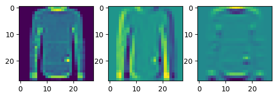

# ML-Yandex-Training-3.0
## Описание
Этот репозиторий содержит мои решения задач 3 сезона Яндекс Тренировок, который был посвящен компьютерному зрению (CV).
 
<a href="https://github.com/alekchetv/ML-Yandex-Training-3.0/blob/main/Сертификат.pdf">Сертификат</a>
## Содержание
- [Классификация изображений MNIST и FMNIST](#hw01_classification)
- [Реализация механизма выделения границ (Sobel filter) и гистограмм ориентированных градиентов (HOG)](#hw02_edge_detection)
### hw01_classification
> Задача: необходимо обучить две нейронные сети для датасетов: MNIST и FMNIST, и добиться как минимум 92% точности на тестовой выборке.
- MNIST (распознавание рукописных цифр) - решается с помощью полносвязной нейронной сети
- Fashion MNIST (классификация предметов одежды) - решается с помощью сверточной нейронной сети
Были написаны пайплайны для обучения моделей.
 
<a href="https://github.com/alekchetv/ML-Yandex-Training-3.0/blob/main/hw01_classification/01_hw_mnist_classification.ipynb">Ссылка на ноутбук с решением(MNIST)</a>
 
<a href="https://github.com/alekchetv/ML-Yandex-Training-3.0/blob/main/hw01_classification/01_hw_mnist_classification.ipynb">Ссылка на ноутбук с решением(FMNIST)</a>

### hw02_edge_detection
> Задача: реализовать механизм выделения границ (Sobel filter) и упрощенный вариант построения гистограммы ориентированных градиентов.
 - Реализована функция выделения границ с помощью фильтра Собеля используя только Numpy

Пример выделения границ - Исходное изображение/границы по X/границы по Y
 
<a href="https://github.com/alekchetv/ML-Yandex-Training-3.0/blob/main/hw02_edge_detection/hw_sobel_and_simple_hog.ipynb#L25">Ссылка на реализацию</a>
 - 